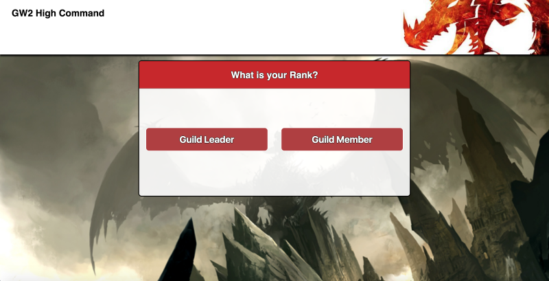
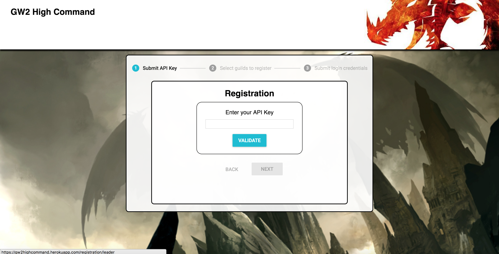
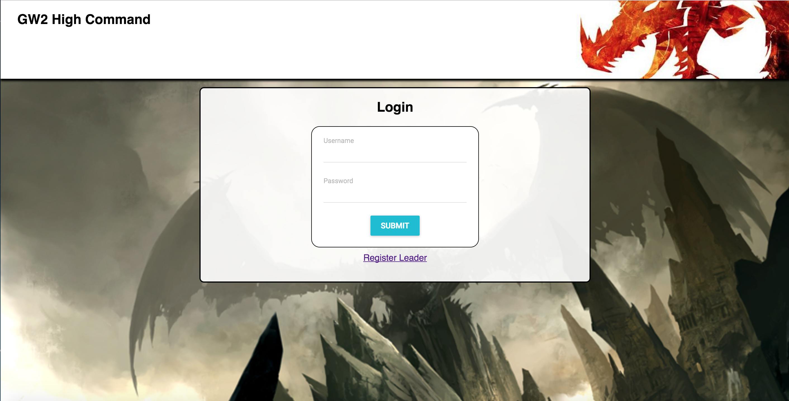
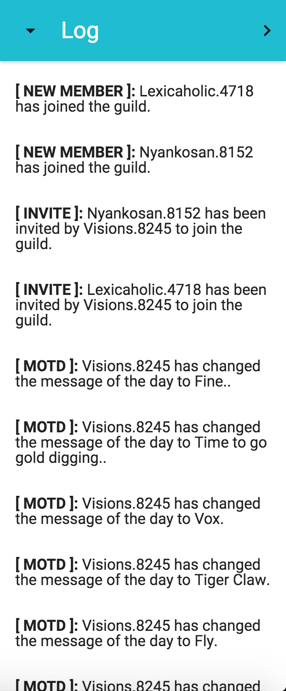
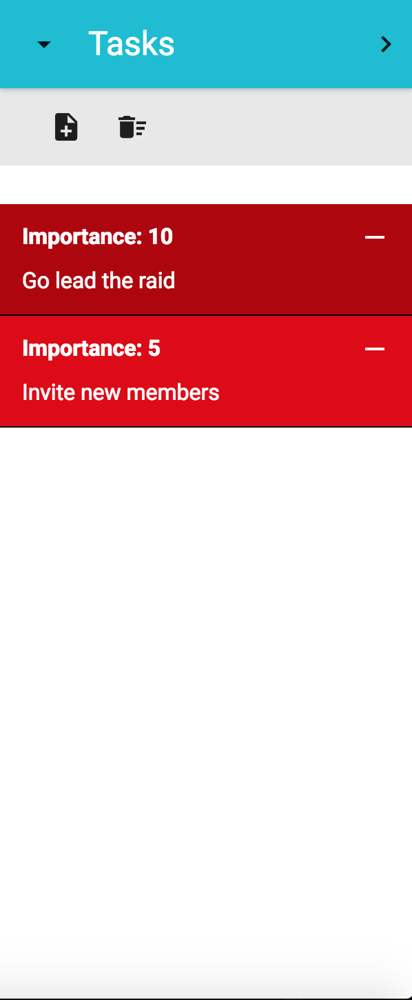
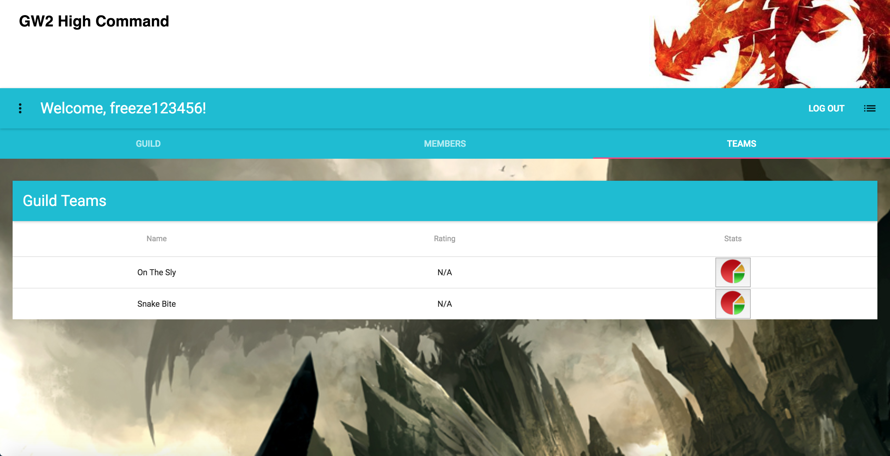
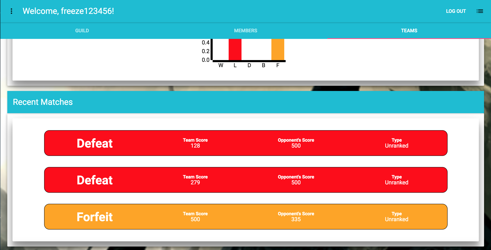
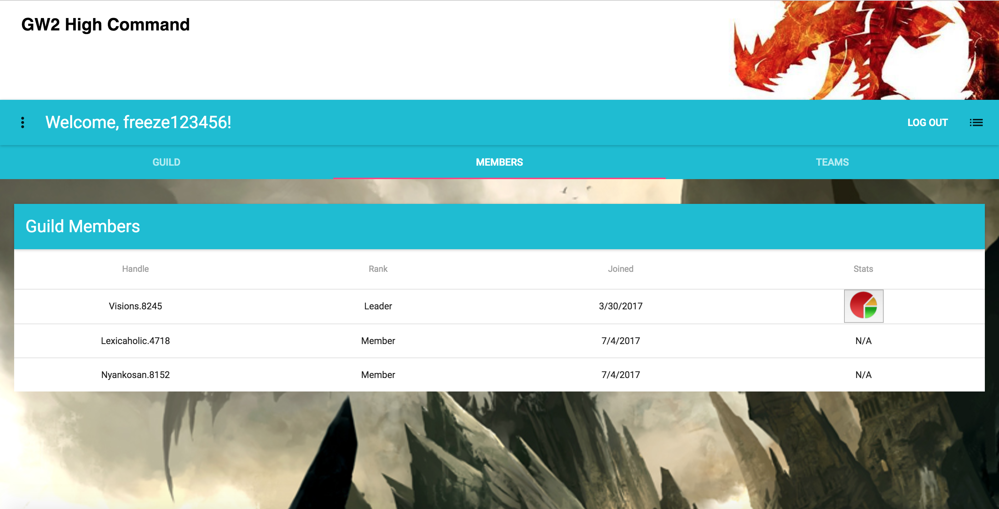
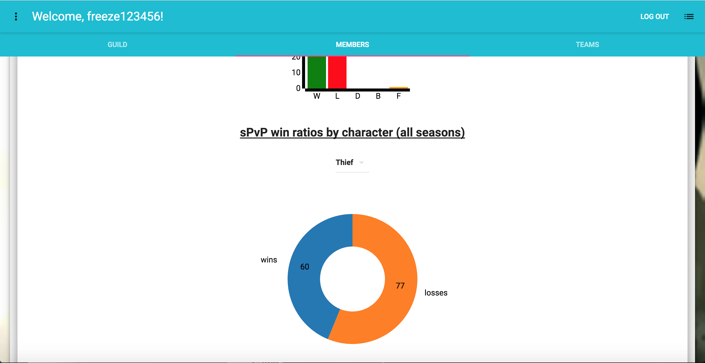
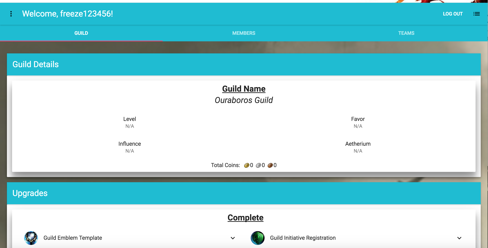

# GW2 High Command 

## Screens
### *Front Page:*

### *Registration:*

### *Login:*

### *Guild Log:*

### *Task List:*

### *Teams:*

### *Team:*

### *Members:*

### *Member:*

### *Guild:*

## Summary
The GW2 High Command app is a application meant for guild leaders who play Guild Wars 2 and need a way to manager their guild better than what Guild Wars 2 already provides in game. Using this app you can register as a leader of a guild or as a member of a guild by inputting an API Key that you create on the Guild Wars 2 official website. 

Leaders can do the following once logged in:  

* Check on guild status and upgrades
* Check certain details/stats of each guild member (select account details, pvp stats, pve completed raids)
* Check certain details/stats of each guild team (members, pvp stats, recent games)
* View the in game guild log
* Create a task list by importance to be done when in game

## Technology
* Built using HTML5, CSS3, Javascript, jQuery, Nodejs, express, React and Redux
* Material-UI was the CSS library used for this app
* Fetch API was used for asynchronous requests
* The [Guild Wars 2 API](https://wiki.guildwars2.com/wiki/API:Main) was used to obtain player information
* MongoDB and Mongoose were used for storing, retrieving and mutating local data.
* Passport.js was used for user authentication
* D3.js was used to make data created pie charts for stats
* Express was used for routing on the back end
* React-Router was used for front end routing

